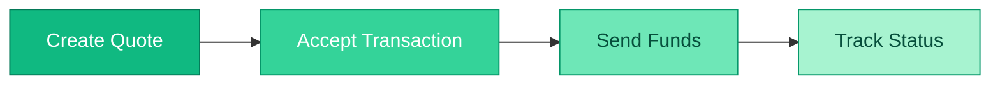

import Tabs from '@theme/Tabs';
import TabItem from '@theme/TabItem';

# Quickstart Guide

This guide takes you from your API key to a full payout in a few minutes.



## Prerequisites

:::info
You will need an API key to proceed. If you don't have one, please contact [support@abroad.com](mailto:support@abroad.com).
:::

- **Base URL**: `https://api.abroad.finance`
- **HTTP client**: `curl`, Postman, or similar.

## 1) Create a quote (target payout)

Ask for how much crypto you need to send to deliver a specific local amount. In this example the recipient should get **400,000 COP** via **Nequi**.

<Tabs>
<TabItem value="request" label="Request">

```bash
curl -X POST https://api.abroad.finance/quote \
  -H "X-API-Key: YOUR_API_KEY" \
  -H "Content-Type: application/json" \
  -d '{
    "amount": 400000,
    "crypto_currency": "USDC",
    "network": "STELLAR",
    "payment_method": "NEQUI",
    "target_currency": "COP"
  }'
```

</TabItem>
<TabItem value="response" label="Response">

```json
{
  "quote_id": "550e8400-e29b-41d4-a716-446655440000",
  "expiration_time": 1732520000,
  "value": 100.5
}
```

</TabItem>
</Tabs>

:::tip
`value` is the crypto amount (USDC) you need to send before the `expiration_time` (epoch ms). Copy the `quote_id` for the next step.
:::

## 2) Accept the transaction

Register the recipient and lock the quote. Include your internal `user_id` so you can reconcile webhooks later.

<Tabs>
<TabItem value="request" label="Request">

```bash
curl -X POST https://api.abroad.finance/transaction \
  -H "X-API-Key: YOUR_API_KEY" \
  -H "Content-Type: application/json" \
  -d '{
    "quote_id": "550e8400-e29b-41d4-a716-446655440000",
    "user_id": "test-user-01",
    "account_number": "3001234567",
    "bank_code": "NEQUI"
  }'
```

</TabItem>
<TabItem value="response" label="Response">

```json
{
  "id": "f4a96c4c-4d1e-4ab2-a6ec-2e1b5070c5db",
  "transaction_reference": "9KlsTE0eSrKm7C4bUHDF2w==",
  "kycLink": null
}
```

</TabItem>
</Tabs>

:::warning KYC Requirement
If `kycLink` is not `null`, you **must** redirect the user to that URL to complete identity verification before the transaction can proceed.
:::

## 3) Send funds on-chain

Send the `value` amount of crypto to the Abroad deposit address for the chosen `network`.

:::danger Critical
You **must** include the `transaction_reference` exactly as the memo/note in your crypto transfer. Failure to do so will result in lost funds.
:::

See [Send Funds](./workflows/send-funds) for detailed instructions.

## 4) Track status

Poll or subscribe to webhooks until the payout completes:

```bash
curl -X GET https://api.abroad.finance/transaction/f4a96c4c-4d1e-4ab2-a6ec-2e1b5070c5db \
  -H "X-API-Key: YOUR_API_KEY"
```

Status values and webhook events are listed in [Status lifecycle](./workflows/status-lifecycle).

## Next steps

- Read [Integration basics](./integration-basics) for headers, IDs, and operational guidance.
- Walk through the [Workflows](./workflows/overview) guide.
- Wire up [Webhooks](./reference/webhooks).
