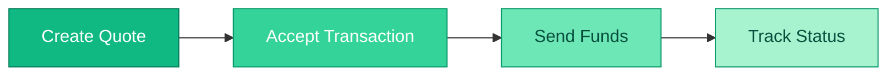

import Tabs from '@theme/Tabs';
import TabItem from '@theme/TabItem';

# Quickstart Guide

This guide takes you from your API key to a full payout in a few minutes.


```mermaid
graph LR
    A[Create Quote] --> B[Accept Transaction]
    B --> C[Send Funds]
    C --> D[Track Status]
    style A fill:#10b981,stroke:#047857,color:#fff
    style B fill:#34d399,stroke:#059669,color:#fff
    style C fill:#6ee7b7,stroke:#059669,color:#064e3b
    style D fill:#a7f3d0,stroke:#059669,color:#064e3b
```

## Prerequisites

:::info
You will need a production API key to proceed. If you don't have one, follow the [self-service setup](./self-service-setup) to create a partner workspace, verify the administrator email, enable MFA, and create the key.
:::

- **Base URL**: `https://api.abroad.finance`
- **HTTP client**: `curl`, Postman, or similar.

## 1) Create a quote (target payout)

Ask for how much crypto you need to send to deliver a specific local amount. In this example the recipient should get **400,000 COP** via **BreB**.

<Tabs>
<TabItem value="request" label="Request">

```bash
curl -X POST https://api.abroad.finance/quote \
  -H "X-API-Key: YOUR_API_KEY" \
  -H "Content-Type: application/json" \
  -d '{
    "amount": 400000,
    "crypto_currency": "USDC",
    "network": "STELLAR",
    "payment_method": "BREB",
    "target_currency": "COP"
  }'
```

</TabItem>
<TabItem value="response" label="Response">

```json
{
  "quote_id": "550e8400-e29b-41d4-a716-446655440000",
  "expiration_time": 1893456000000,
  "fee": {
    "amount": "0.5",
    "currency": "USDC",
    "type": "combined"
  },
  "value": 100.5
}
```

</TabItem>
</Tabs>

:::tip
`value` is the total crypto amount (USDC) you need to send before `expiration_time` (Unix epoch milliseconds). `fee.amount` is already included in `value`; do not add it again. Copy the `quote_id` for the next step.
:::

## 2) Accept the transaction

Register the recipient and lock the quote. Include your internal `user_id` so you can reconcile webhooks later.

<Tabs>
<TabItem value="request" label="Request">

```bash
curl -X POST https://api.abroad.finance/transaction \
  -H "X-API-Key: YOUR_API_KEY" \
  -H "Content-Type: application/json" \
  -d '{
    "quote_id": "550e8400-e29b-41d4-a716-446655440000",
    "user_id": "test-user-01",
    "account_number": "3001234567"
  }'
```

</TabItem>
<TabItem value="response" label="Response">

```json
{
  "id": "f4a96c4c-4d1e-4ab2-a6ec-2e1b5070c5db",
  "kycRequired": false,
  "transaction_reference": "9KlsTE0eSrKm7C4bUHDF2w==",
  "payment_context": {
    "amount": 100.5,
    "blockchain": "STELLAR",
    "chainFamily": "stellar",
    "chainId": "stellar:pubnet",
    "cryptoCurrency": "USDC",
    "decimals": 7,
    "depositAddress": "GA...",
    "memo": "9KlsTE0eSrKm7C4bUHDF2w==",
    "memoType": "text",
    "mintAddress": null,
    "notify": { "endpoint": null, "required": false },
    "rpcUrl": "https://horizon.stellar.org"
  }
}
```

</TabItem>
</Tabs>

:::warning KYC requirement
If `kycRequired` is `true`, **no transaction was created** — `id`, `transaction_reference`, and `payment_context` come back null. Submit the user's identity details to `POST /kyc` and retry with a fresh quote. See [Limits and validation](./resources/limits#kyc-gating).
:::

**Account note:** send `account_number`, or `qr_code` for a PIX QR payload. There is no `bank_code` field — the rail is resolved server-side.

## 3) Send funds on-chain

`payment_context` carries everything you need: the `depositAddress`, the exact `amount`, the `memo` when one applies, and the `mintAddress` for token transfers. Read it from the response instead of hard-coding addresses.

:::danger Critical (Stellar only)
You **must** include `payment_context.memo` (identical to `transaction_reference`) as the memo/note in your Stellar transfer. Funds sent without it cannot be matched automatically.
:::

For **Solana** and **Celo** there is no memo. `payment_context.notify.required` is `true` for those chains — after broadcasting, POST the hash to `/payments/notify` so we can confirm the deposit and start the payout.

See [Send Funds](./workflows/send-funds) for detailed instructions.

## 4) Track status

Poll or subscribe to webhooks until the payout completes:

```bash
curl -X GET https://api.abroad.finance/transaction/f4a96c4c-4d1e-4ab2-a6ec-2e1b5070c5db \
  -H "X-API-Key: YOUR_API_KEY"
```

Status values and webhook events are listed in [Status lifecycle](./workflows/status-lifecycle).

## Next steps

- Connect a compatible assistant through the read-only [AI integration](./ai-integration) to validate requests and inspect transaction status without giving it an API key.
- Read [Integration basics](./integration-basics) for headers, IDs, and operational guidance.
- Walk through the [Workflows](./workflows/overview) guide.
- Wire up [Webhooks](./reference/webhooks).
