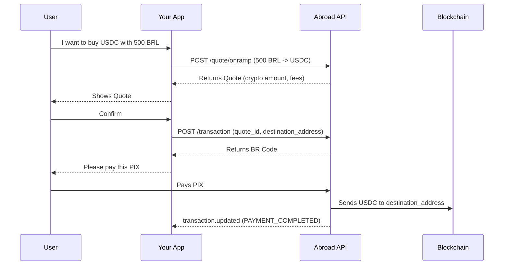

# Buy crypto with PIX (onramp)

The workflows described so far move crypto **into** local currency. This one runs
the other way: your user pays a PIX in Brazilian Reais and receives stablecoin at
a wallet address you supply.

The shape is the mirror of a payout — **Quote**, **Accept**, **Pay** — but the
legs swap. Instead of giving your user an address to send crypto to, Abroad gives
you a PIX **BR Code** for them to pay, and delivers the crypto once it settles.

## Lifecycle

1. **Create an onramp quote**: you state the BRL amount your user will pay. Abroad
   returns how much stablecoin they receive.
2. **Accept the transaction**: you pass the quote and the destination wallet.
   Abroad returns a copy-paste **BR Code**.
3. **Your user pays the PIX** from any Brazilian bank.
4. **Abroad delivers the crypto** to the destination wallet and reports the
   on-chain hash.



## 1. Create an onramp quote (`POST /quote/onramp`)

```bash
curl -X POST https://api.abroad.finance/quote/onramp \
  -H "X-API-Key: YOUR_API_KEY" \
  -H "Content-Type: application/json" \
  -d '{
    "fiat_amount": 500,
    "target_currency": "BRL",
    "crypto_currency": "USDC",
    "network": "CELO",
    "payment_method": "PIX"
  }'
```

| Field | Meaning |
| :--- | :--- |
| `fiat_amount` | The BRL your user pays. |
| `crypto_currency` / `network` | The asset and chain they receive it on. |
| `payment_method` | `PIX`. |

The response has the same shape as a payout quote, but `value` is the **crypto
amount your user receives**:

```json
{
  "quote_id": "0a1b2c3d-...",
  "value": 91.482,
  "expiration_time": 1754400000000,
  "fee": { "amount": "0.914", "currency": "USDC", "type": "combined" }
}
```

The fee is expressed in the crypto leg — it is the difference between what the
raw desk rate would have delivered and what your user actually receives.

## 2. Accept the transaction (`POST /transaction`)

Pass `destination_address` instead of `account_number`:

```bash
curl -X POST https://api.abroad.finance/transaction \
  -H "X-API-Key: YOUR_API_KEY" \
  -H "Content-Type: application/json" \
  -d '{
    "quote_id": "0a1b2c3d-...",
    "user_id": "your-user-42",
    "destination_address": "0x5aAeb6053F3E94C9b9A09f33669435E7Ef1BeAed"
  }'
```

The response carries `payment_instructions`:

```json
{
  "id": "9f8e7d6c-...",
  "kycRequired": false,
  "payment_instructions": {
    "br_code": "00020126580014BR.GOV.BCB.PIX...",
    "expires_at": 1754403600000
  },
  "transaction_reference": null
}
```

Render `br_code` as a QR or offer it as copy-paste. `transaction_reference` is
null on an onramp — there is no memo for your user to include, because they are
paying a PIX rather than sending crypto.

### The destination address is validated up front

Abroad checks the address against the selected network before returning a BR
Code, so a malformed or wrong-chain address fails at acceptance rather than
after your user has already paid. A Celo address must pass its EIP-55 checksum;
a Solana address must be a valid on-curve public key; a Stellar address must be a
classic `G...` account.

## 3. Your user pays

Nothing to call. Abroad detects the settled PIX and starts the delivery.

## 4. Delivery

Abroad sends the crypto and moves the transaction to `PAYMENT_COMPLETED`, with
the delivery hash in `on_chain_tx_hash`. You are notified by the same
`transaction.updated` webhook a payout uses — the event contract is identical in
both directions.

## Anyone can pay, and the crypto goes to the wallet you name

The BR Code can be paid from any Brazilian account — the payer does not have to
be the person receiving the crypto. Once the PIX settles, Abroad delivers to the
`destination_address` you supplied, whoever funded it.

`tax_id` is optional. When you send one it is stored on the transaction and
returned on reads; it is not matched against the payer and does not gate
delivery. The CPF that actually paid is recorded separately from the deposit for
your reconciliation.

## Failure and refunds

If the crypto cannot be delivered — for example the destination becomes
unusable — the BRL is returned by PIX to the account that paid it. Abroad never
refunds to an address supplied in the request, only to the original payer.

## Supported corridors

| You pay | They receive | Networks |
| :--- | :--- | :--- |
| BRL via PIX | USDC | Stellar, Solana, Celo |

Corridors are enabled individually. A corridor that is not configured returns
`corridor_unavailable` from the quote endpoint.

## Differences from a payout, at a glance

| | Payout (crypto → fiat) | Onramp (fiat → crypto) |
| :--- | :--- | :--- |
| Quote endpoint | `POST /quote` | `POST /quote/onramp` |
| You state | The fiat they receive | The fiat they pay |
| `value` in the response | Crypto they send | Crypto they receive |
| Destination field | `account_number` | `destination_address` |
| Funding | User sends crypto with a memo | User pays a BR Code |
| `transaction_reference` | The memo to include | Null |
| `on_chain_tx_hash` | Their inbound deposit | Our outbound delivery |
