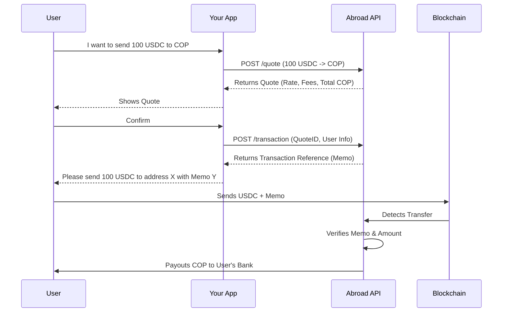

# Workflows Overview

Integrating with Abroad typically involves a three-step process: **Quote**, **Accept**, and **Pay**.

## The Lifecycle of a Transaction

1.  **Create a Quote**: You ask Abroad for an exchange rate and fees for a specific amount and currency pair.
2.  **Accept the Transaction**: If the user accepts the quote, you create a transaction. This locks the rate and generates a unique reference.
3.  **Send Funds**: You (or the user) send the source funds (e.g., USDC) to Abroad's wallet, including the unique reference in the memo/note.
4.  **Payout**: Once Abroad detects the incoming funds, we automatically process the payout to the target account.

For status definitions and webhook behavior, see [Status lifecycle](./status-lifecycle) and [Webhooks](../reference/webhooks).
