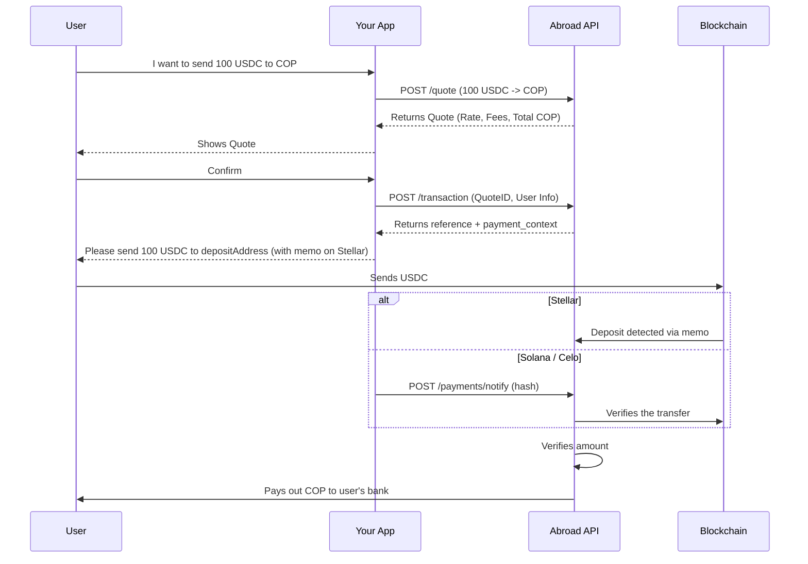

# Workflows Overview

Integrating with Abroad typically involves a three-step process: **Quote**, **Accept**, and **Pay**.

## The Lifecycle of a Transaction

1.  **Create a Quote**: You ask Abroad for an exchange rate and fees for a specific amount and currency pair.
2.  **Accept the Transaction**: If the user accepts the quote, you create a transaction. This locks the rate and returns a unique reference plus a `payment_context` describing where and how to send the funds.
3.  **Send Funds**: You (or the user) send the source funds to the `depositAddress` from `payment_context` — with the memo on Stellar, or followed by a `/payments/notify` call on Solana and Celo.
4.  **Payout**: Once Abroad confirms the incoming funds, we automatically process the payout to the target account.

```mermaid
sequenceDiagram
    participant User
    participant Partner as Your App
    participant Abroad as Abroad API
    participant Blockchain

    User->>Partner: I want to send 100 USDC to COP
    Partner->>Abroad: POST /quote (100 USDC -> COP)
    Abroad-->>Partner: Returns Quote (Rate, Fees, Total COP)
    Partner-->>User: Shows Quote
    User->>Partner: Confirm
    Partner->>Abroad: POST /transaction (QuoteID, User Info)
    Abroad-->>Partner: Returns reference + payment_context
    Partner-->>User: Please send 100 USDC to depositAddress (with memo on Stellar)
    User->>Blockchain: Sends USDC
    alt Stellar
        Blockchain->>Abroad: Deposit detected via memo
    else Solana / Celo
        Partner->>Abroad: POST /payments/notify (hash)
        Abroad->>Blockchain: Verifies the transfer
    end
    Abroad->>Abroad: Verifies amount
    Abroad->>User: Pays out COP to user's bank
```

Abroad also emits [webhooks](../reference/webhooks) at each step, so you do not have to poll.

For status definitions and webhook behavior, see [Status lifecycle](./status-lifecycle) and [Webhooks](../reference/webhooks).
